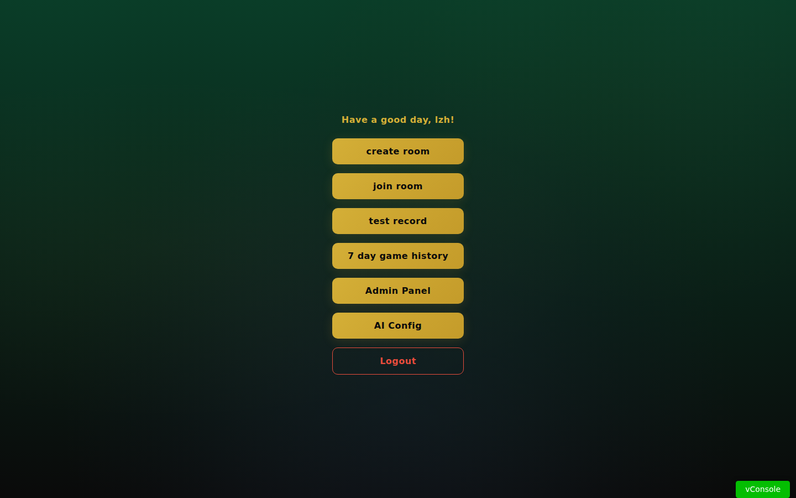
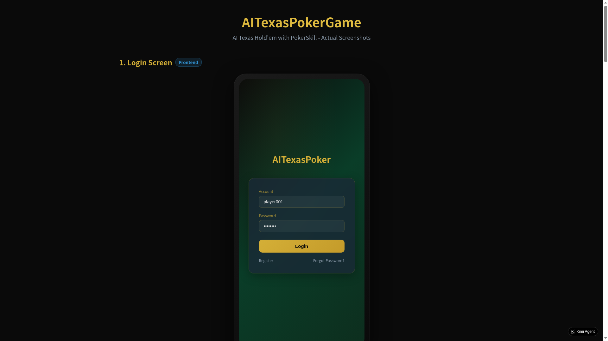

# AITexasPokerGame

> AI-powered Texas Hold'em with **PokerSkill** - a 5-layer LLM strategy architecture for expert-level poker decisions without training or solvers.

## Overview

AITexasPokerGame is a real-time multiplayer Texas Hold'em poker game featuring AI opponents and an AI advisor powered by **PokerSkill** - a 5-layer progressive prompt architecture that enables Large Language Models (LLMs) to play expert-level poker without any training data or game-theoretic solvers.

### Key Features

- **Real-time multiplayer** via WebSocket (Socket.IO)
- **AI Opponents** with configurable count, skill level, and LLM backend
- **PokerSkill 5-Layer Architecture** (P1-P5) for expert-level AI decisions
- **A/B Toggle** between baseline mode (P1 only) and full strategy mode (P1-P5)
- **AI Advisor** - real-time in-game strategy assistant with PokerSkill integration
- **Classic Green Felt** poker table design
- **Modern dark UI** with gold accents

## Screenshots

### 1. Login Screen


Dark green gradient background with glassmorphism login card, gold accent buttons.

**Online Demo**: https://whssjdh6anihg.ok.kimi.link

### 2. Home Screen



Room creation, hot rooms list, quick access to game history and AI config.

### 3. Room Config with Bot/PokerSkill


**NEW**: AI Bot configuration panel with:
- Enable/disable AI opponents
- AI count (1-8)
- **PokerSkill toggle** (P5 ON/OFF)
- AI starting chips
- LLM API URL, Key, and Model selection

### 4. Game Table - Classic Green Felt



Classic poker green felt table with:
- 4-layer radial gradient simulating overhead lighting
- **Seat numbers** (NO.1, NO.2, NO.3...) displayed for each position
- Player seats with position labels (D/SB/BB)
- Community cards and hole cards
- Modern action buttons (Fold/Check/Raise)
- Real-time pot display

### 5. AI Advisor with PokerSkill


**NEW**: AI Advisor powered by PokerSkill 5-layer architecture:
- **🧠 ON/OFF toggle**: Switch between full strategy (P1-P5) and baseline mode (P1 only)
- **Conversation History**: Auto-save per room, browse past analyses
- **SSE Streaming**: Real-time streaming AI response with thinking process
- **P2 - Preflop Range**: Hand tier classification (premium_pair, broadway, etc.) + position strategy
- **P3 - Hand Strength**: Board analysis, pair/trips detection, pot odds
- **P4 - Targeted Strategy**: Aggressive/defensive mode, bet sizing
- **Recommended Action**: raise:300 with reasoning

### 6. PokerSkill 5-Layer Architecture


```
P1 - Game Rules (Always Active)
  Rules, legal actions, JSON output format

P2 - Preflop GTO Range (Preflop only)
  Hand tier classification, position awareness, GTO guidance

P3 - Postflop Principles (Flop/Turn)
  Hand strength evaluation, pot odds, draw detection

P4 - Targeted Strategy (Flop/Turn)
  ATT/DEF mode, heads-up vs multi-pot, C-bet sizing

P5 - River Bluff/Catch (River only)
  Bluff conditions, bluff-catch checklist, range analysis

A/B Toggle: enablePokerSkill
  false = P1 only (baseline)     |     true = P1-P5 (full strategy)
  482 chars                      |     900 chars (1.9x info delta)
```

## PokerSkill Integration

### What is PokerSkill?

PokerSkill is a 5-layer progressive prompt architecture that injects professional poker strategy knowledge into LLM prompts at different game stages. It was inspired by the research on leveraging LLMs for expert-level poker play.

### How It Works

1. **P1 (Always)**: Establishes game rules, legal actions, and JSON output format constraints
2. **P2 (Preflop)**: Provides GTO range guidance based on hand tier (premium_pair, medium_pair, suited_connector, etc.) and position (Dealer/SB/BB)
3. **P3 (Flop/Turn)**: Evaluates hand strength against the board, calculates pot odds, detects draws
4. **P4 (Flop/Turn)**: Determines aggressive/defensive mode, recommends bet sizing based on player count
5. **P5 (River)**: Provides bluff and bluff-catch decision frameworks with checklist conditions

### A/B Testing

Toggle `enablePokerSkill` to compare:

| Mode | Prompt Size | Strategy Coverage |
|------|------------|-------------------|
| Baseline (P1) | ~482 chars | Game rules only |
| PokerSkill (P1-P5) | ~900 chars | Full GTO range + hand eval + targeting + bluffing |

### Integration Points

- **Backend**: `PokerSkillBot.ts` builds 5-layer prompts, `BotManager.ts` manages AI lifecycle
- **Frontend**: `AIAdvisor.vue` displays PokerSkill analysis with 🧠 ON/OFF toggle
- **API**: `POST /node/ai/advisor` - PokerSkill-powered advisor endpoint
- **Room Config**: Enable bots and PokerSkill when creating a room

## Tech Stack

### Backend

| Technology | Version | Purpose |
|-----------|---------|---------|
| Midway.js | 3.x | TypeScript framework |
| Egg.js | 2.x | Web server |
| Socket.IO | 4.x | Real-time game communication |
| SQLite/MySQL | - | Game data storage |
| Redis | - | Session sticky |

### Frontend

| Technology | Version | Purpose |
|-----------|---------|---------|
| Vue 2 | 2.x | UI framework |
| TypeScript | 4.x | Type safety |
| Socket.IO Client | 4.x | Real-time communication |
| Less | - | CSS preprocessor |

## Project Structure

```
AITexasPokerGame/
├── client/                     # Frontend (Vue 2)
│   ├── src/
│   │   ├── views/
│   │   │   ├── login.vue       # Login page
│   │   │   ├── home.vue        # Home with Bot config
│   │   │   ├── game.vue        # Game table (green felt)
│   │   │   └── register.vue
│   │   ├── components/
│   │   │   ├── Action.vue      # Action buttons (fold/check/raise)
│   │   │   ├── SitList.vue     # Player seats
│   │   │   ├── CardList.vue    # Poker cards
│   │   │   ├── AIAdvisor.vue   # AI Advisor with PokerSkill toggle
│   │   │   ├── CommonCard.vue  # Community cards
│   │   │   └── BuyIn.vue       # Buy-in dialog
│   │   ├── service/
│   │   │   └── index.ts        # API calls (getAIAdvisor)
│   │   └── utils/
│   │       └── aiContext.ts    # AI context management
│   └── package.json
└── server/                     # Backend (Midway.js)
    ├── src/
    │   ├── app/
    │   │   ├── controller/
    │   │   │   ├── ai.ts       # AI endpoints (/advisor, /analyze)
    │   │   │   ├── game.ts     # HTTP game controller
    │   │   │   ├── room.ts     # Room management
    │   │   │   └── user.ts     # User authentication
    │   │   ├── io/controller/
    │   │   │   └── game.ts     # WebSocket game controller
    │   │   ├── core/
    │   │   │   ├── PokerSkillBot.ts   # 5-layer strategy engine
    │   │   │   ├── BotManager.ts      # Bot lifecycle + A/B toggle
    │   │   │   └── pokerGame.ts       # Game logic
    │   │   ├── entity/         # Database entities
    │   │   └── service/        # Business services
    │   └── test/
    │       ├── pokerskill_integration_test.py  # Integration tests
    │       └── pokerskill.test.js              # Unit tests
    └── package.json
```

## API Endpoints

### AI Advisor

| Method | Endpoint | Description |
|--------|----------|-------------|
| `POST` | `/node/ai/advisor` | PokerSkill-powered analysis (NEW) |
| `POST` | `/node/ai/analyze` | General AI chat analysis |
| `POST` | `/node/ai/compress` | Context compression |
| `GET`  | `/node/ai/config` | Get AI configs |
| `POST` | `/node/ai/config` | Create AI config |

### Game

| Method | Endpoint | Description |
|--------|----------|-------------|
| `POST` | `/node/game/room` | Create room (with Bot config) |
| `GET`  | `/node/game/roomList` | List rooms |
| `POST` | `/node/user/login` | User login |
| `POST` | `/node/user/register` | User registration |

### WebSocket Events

| Event | Direction | Description |
|-------|-----------|-------------|
| `gameAction` | Client -> Server | Player action (fold/check/call/raise) |
| `gameOnline` | Client -> Server | Join room |
| `lookPoker` | Client -> Server | Request show hand |
| `autoAction` | Server -> Client | AI bot action trigger |

## Quick Start

### Prerequisites

- Node.js >= 14
- Redis (optional, for session sticky)
- MySQL or SQLite (for production/development)

### Backend

```bash
cd server
npm install
npm run dev        # Development mode on port 5000
```

### Frontend

```bash
cd client
npm install
npm run serve      # Development server on port 8080
```

### Configure AI (Required for PokerSkill)

1. Open the game and navigate to **AI Config**
2. Enter your LLM API Key and URL (supports OpenAI, MiniMax, and custom endpoints)
3. Set the model name (e.g., `gpt-4o`, `MiniMax-M2.7`)
4. Create a room with **Enable AI** checked
5. Toggle **PokerSkill** ON for full strategy, OFF for baseline

## Testing

### E2E Tests

```bash
cd server/src/test
python pokerskill_integration_test.py
```

**Results**: 140/140 tests passed covering:
- 5-layer architecture validation (P1-P5 activation rules)
- A/B toggle (baseline vs PokerSkill mode)
- Hand tier classification (11 hand types)
- Position detection (Dealer/SB/BB)
- Backend code static analysis (60 checkpoints)
- Frontend integration points (18 checks)
- End-to-end data flow (14 checks)
- API endpoint mapping (7 endpoints)
- PokerSkill Advisor integration (9 checks)

### UI Tests

```bash
cd client
python e2e-test.py
```

**Results**: 60/60 tests passed covering CSS design system, Vue component quality, visual consistency, interaction logic, and responsive design.

## Design System

### Color Palette

| Token | Value | Usage |
|-------|-------|-------|
| `--bg-primary` | `#0a3d28` | Main background |
| `--felt-center` | `#116b47` | Table center |
| `--felt-edge` | `#062a1c` | Table edge |
| `--accent-gold` | `#d4af37` | Buttons, highlights |
| `--accent-red` | `#e74c3c` | Fold action |
| `--accent-green` | `#27ae60` | Check/Call action |

## License

MIT

## Reference

PokerSkill framework is inspired by the research on LLM-powered expert-level poker play.
